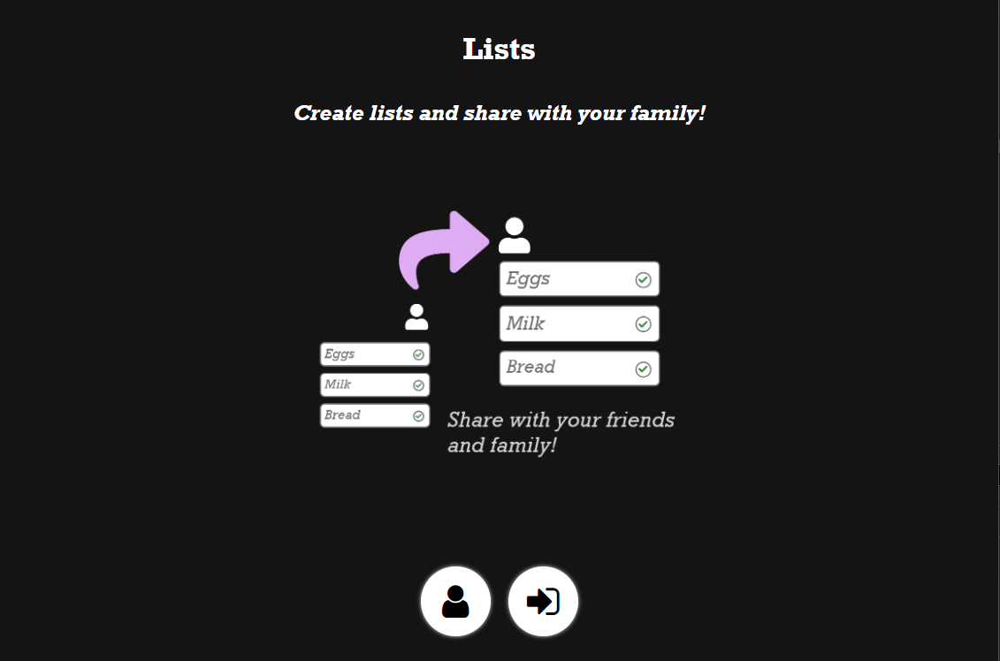
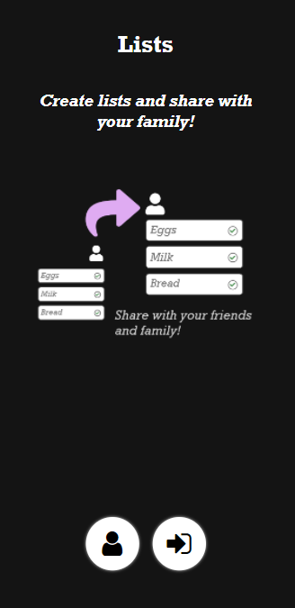
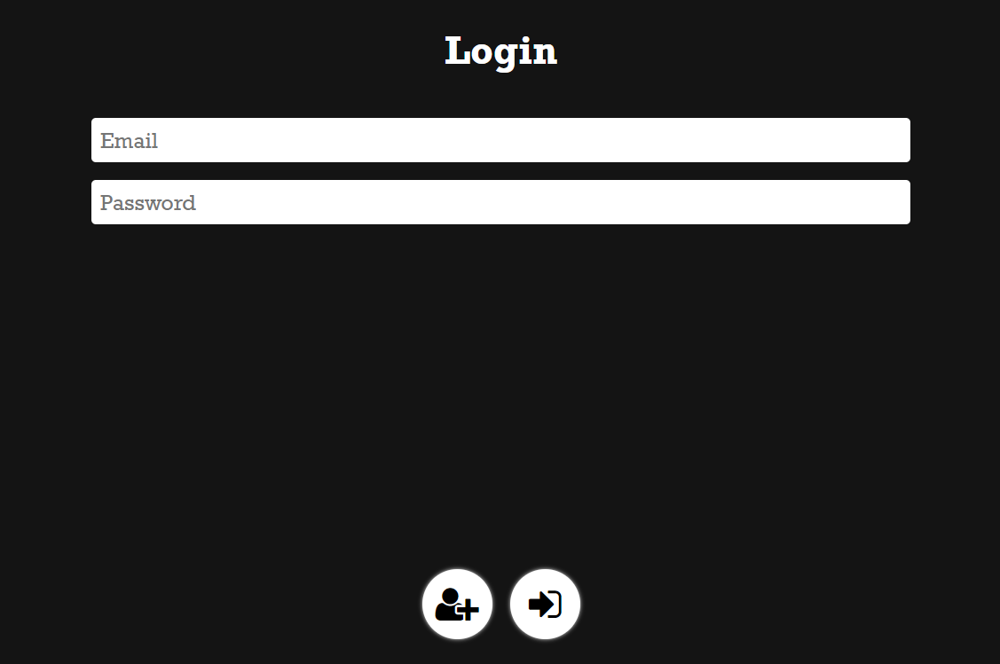
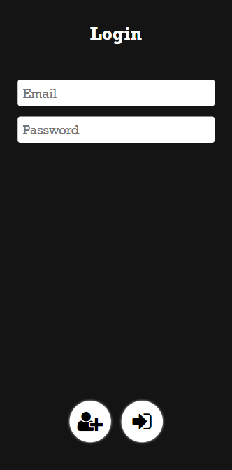
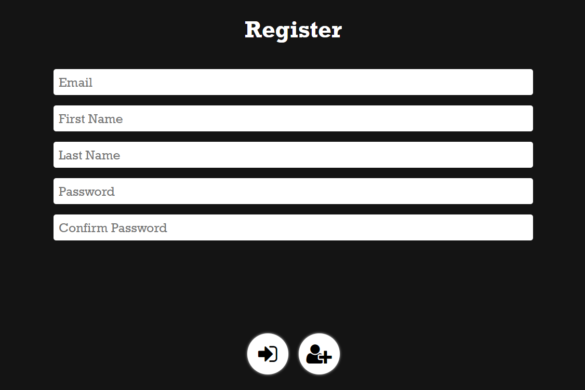
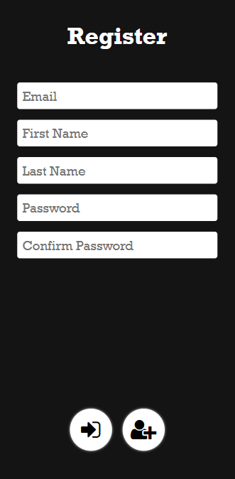
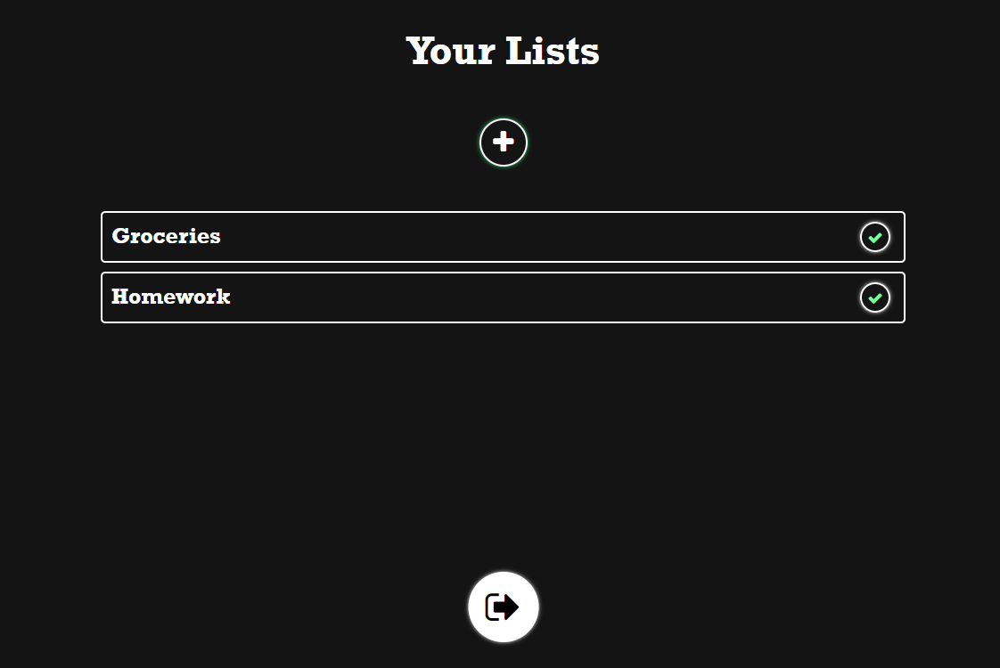
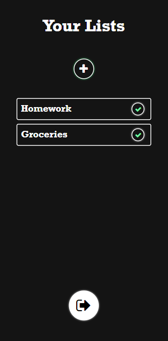
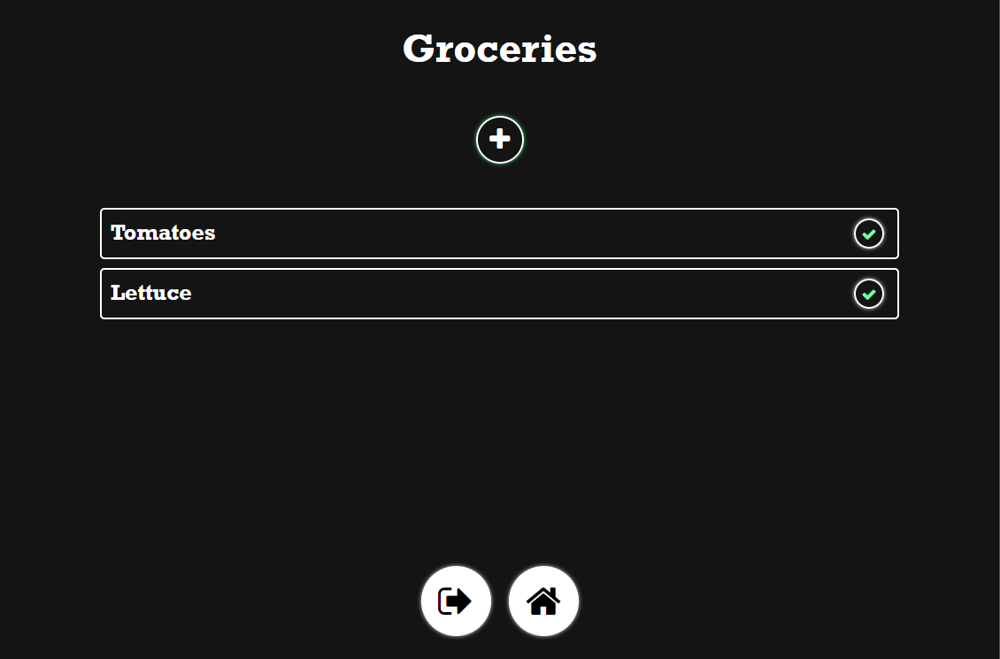
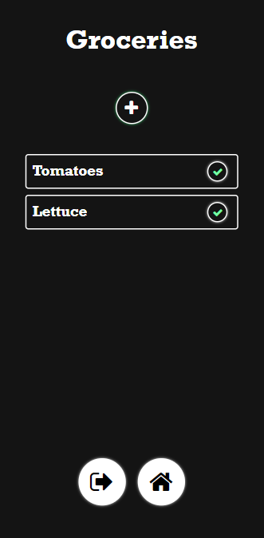

<h1 style="color: #99f8ff">Lists Project Frontend</h1>

### Date Started : 05/14/2021

### Author : IDrumsey

### Purpose : Learn ReactJS through building the frontend for the Lists API ( [API Repo](https://github.com/IDrumsey/Lists-API-NodeJS) )

### Server side code - https://github.com/IDrumsey/Lists-API-NodeJS

---

## Pages

- Welcome
- Login
- Register
- Home
- List

## Final Product Pictures

##  

## _Welcome Page_

 

 
<!-- Welcome page images -->

### Desktop

### Mobile

 
 

## _Login Page_

 

 
<!-- Login page images -->

### Desktop

### Mobile

 
 

## _Register Page_

 

 
<!-- Register page images -->

### Desktop

### Mobile

 
 

## _Home Page_

 

 
<!-- Home page images -->

### Desktop

### Mobile

 
 

## _List Page_

 

 
<!-- List page images -->

### Desktop

### Mobile

 
 

<!-- <iframe src="https://www.youtube.com/" frameborder="0" allowfullscreen="true"> </iframe> -->
